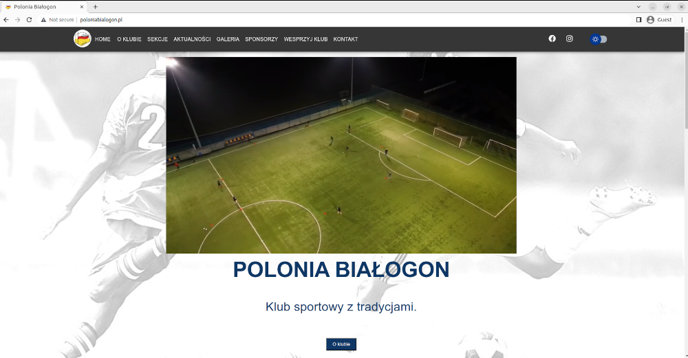
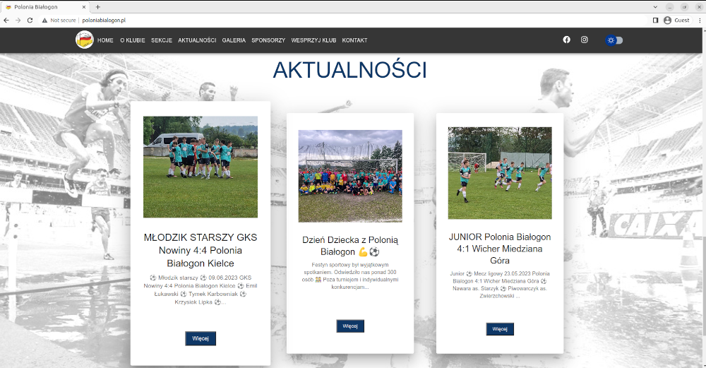

# poloniabialogon
> Responsive website of the football club Polonia Białogon

## Information.
- Web app is created in React with usage of Create React App
- It uses also Material UI library
- Project contains admin panel for editing the blog articles and the gallery
- It works with Firebase for storing the articles (Firestore) images (Storage) and admin authentication (Authentication)

## Status
- Website is available at the addres: www.poloniabialogon.pl
 
    
